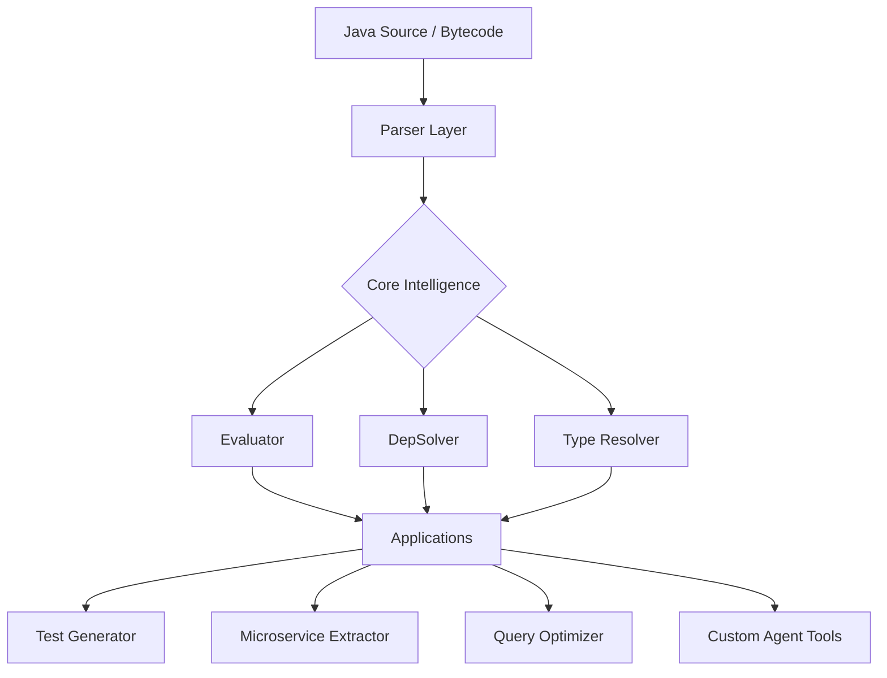

# Antikythera - Java Code Intelligence Engine

**Current Version**: Agent Reference Guide
**Purpose**: A versatile platform for **Static Analysis**, **Symbolic Execution**, and **Automated Refactoring** of Java applications.

---

## 🚀 Core Capabilities

Antikythera is more than a test generator. It is a modular engine that understands, executes, and transforms Java code.

| Capability | Description | Modules |
| :--- | :--- | :--- |
| **🔎 Deep Analysis** | Parse source/bytecode, resolve complex types, and build dependency graphs. | `parser`, `depsolver` |
| **🧠 Symbolic Execution** | Execute code paths abstractly to understand behavior without running the app. | `evaluator` |
| **🔧 Transformation** | Refactor code, extract microservices, and convert queries (JPA/HQL → SQL). | `depsolver`, `generator` |
| **🧪 Test Generation** | Auto-generate Unit & API tests using the intelligence above. | `generator` |

---

## 🏗 Architecture: The "Engine" Concept

Think of Antikythera as a layered engine. You can invoke the lower layers directly for custom tasks.



### 1. The Parser Layer (`parser/`)
**Goal**: Turn code into a computable model.
*   **`AbstractCompiler`**: The foundation. Parses files and resolves types using a smart classpath scanner.
*   **`AntikytheraRunTime`**: Distributed cache for ASTs (`CompilationUnit`) and Type Metadata (`TypeWrapper`).

### 2. The Evaluator Layer (`evaluator/`)
**Goal**: "Run" the code safely to learn what it does.
*   **`Evaluator`**: A symbolic VM. It processes AST nodes, tracks variable states, and handles control flow (branches, loops).
*   **`SpringEvaluator`**: Aware of Spring Contexts. Can simulate `@Autowired` injection and `@Value` resolution.
*   **`AKBuddy`**: Creates dynamic proxies (`ByteBuddy`) so the Evaluator can intercept method calls on real objects.

### 3. The Dependency & Solver Layer (`depsolver/`)
**Goal**: Understand connections.
*   **`DepSolver`**: Builds directed graphs of class/method usage. Used for extracting slice-able code (e.g., "Extract this Service to a generated library").
*   **`Graph`**: Cyclic graph detection and resolution.

---

## 🛠 versatile Use Cases & Entry Points

### Use Case A: "I need to analyze code dependencies"
*Don't run the test generator. Use the Solver directly.*

```java
// 1. Configure the analyzer
DependencyAnalyzer analyzer = new DependencyAnalyzer();

// 2. Collect dependencies for a set of methods
Set<GraphNode> functionalitySlice = analyzer.collectDependencies(targetMethods);

// 3. Query the graph
boolean hasCycle = analyzer.hasCycles(functionalitySlice);
Set<GraphNode> externalDeps = analyzer.getCrossboundaryDependencies(functionalitySlice);
```

### Use Case B: "I need to understand what a method returns"
*Use the Evaluator to virtually execute the method.*

```java
// 1. Create an Evaluator for the class
Evaluator eval = EvaluatorFactory.create("com.example.PricingService", SpringEvaluator.class);

// 2. Setup inputs (optional)
eval.setField("basePrice", new Variable(100.0));

// 3. Execute a method AST node
Variable result = eval.executeMethod(calculateMethodNode);

// 4. Inspect the result
System.out.println("Returned: " + result.getValue()); // "120.0"
```

### Use Case C: "I need to translate JPA/HQL to SQL"
*Use the Converter subsystem.*

```java
// Method Name -> SQL
List<String> parts = MethodToSQLConverter.extractComponents("findActiveUsersByRegion");
// Output logic: WHERE status = 'ACTIVE' AND region = ?

// HQL -> SQL
HQLParserAdapter adapter = new HQLParserAdapter(cu, entityType);
ConversionResult res = adapter.convertToNativeSQL("FROM User u WHERE u.id = :id");
System.out.println(res.getNativeSql()); // "SELECT * FROM users WHERE id = ?"
```

### Use Case D: "I need to generate tests"
*The classic use case.*

```java
Antikythera.getInstance().generateUnitTests();
```

---

## 🔧 Key Configuration (`generator.yml`)

The engine is configured via YAML.

```yaml
base_path: /src/main/java       # Where to look for code
output_path: /src/test/java     # Where to put artifacts
database:
  url: jdbc:postgres://...      # For live query analysis (optional)
  run_queries: false            # Set true to execute queries during analysis
```

## 🧩 Extending the Engine

*   **New Language Feature?** Add a handler to `Evaluator.evaluateExpression`.
*   **New Framework?** Extend `AbstractCompiler` (e.g., `QuarkusCompiler`).
*   **New Output?** Implement a new Generator (e.g., `DocumentGenerator` using `DepSolver` data).

---

## 💡 Agent "Cheat Sheet"

| Task | Core Component | Method to Call |
| :--- | :--- | :--- |
| **Resolve Type** | `parser.AbstractCompiler` | `findType(cu, "Name")` |
| **Parse File** | `parser.AbstractCompiler` | `compile(path)` |
| **Execute Logic** | `evaluator.Evaluator` | `evaluateMethodCall(mce)` |
| **Find Dependencies** | `depsolver.DepSolver` | `processMethod(signature)` |
| **Convert Query** | `parser.converter` | `MethodToSQLConverter` |
| **Get Entity Info** | `parser.converter` | `EntityMappingResolver` |

**Rule of Thumb**: Always check `AntikytheraRunTime` caches before doing heavy lifting.
