# Unit Test Generation Sequence Diagram

This document contains a sequence diagram showing the complete flow of generating unit tests for a method, from the starting point (method to be tested) to the end point (all unit tests for all identifiable branching created).

## Sequence Diagram

```mermaid
sequenceDiagram
    participant Method as MethodDeclaration<br/>(Method to Test)
    participant SP as ServicesParser
    participant UTG as UnitTestGenerator
    participant SE as SpringEvaluator
    participant Eval as Evaluator
    participant Branch as Branching
    participant LOC as LineOfCode
    participant MR as MethodResponse
    participant File as Test File

    Note over Method,File: Starting Point: Method to be tested

    Method->>SP: evaluateMethod(md, argumentGenerator)
    activate SP
    
    SP->>UTG: Factory.create("unit", cu)
    activate UTG
    UTG->>UTG: addBeforeClass()
    UTG-->>SP: UnitTestGenerator instance
    deactivate UTG
    
    SP->>SE: EvaluatorFactory.create(cls, SpringEvaluator.class)
    activate SE
    SE->>SE: Initialize evaluator
    SE-->>SP: SpringEvaluator instance
    deactivate SE
    
    SP->>SE: evaluator.addGenerator(generator)
    SP->>SE: evaluator.setOnTest(true)
    SP->>SE: evaluator.setArgumentGenerator(gen)
    SP->>SE: evaluator.reset()
    SP->>Branch: Branching.clear()
    SP->>SE: evaluator.visit(md)
    activate SE
    
    Note over SE,Branch: Main Branch Coverage Loop (up to 16 iterations)
    
    loop For each branch path (until all branches covered)
        SE->>Branch: Branching.size(md)
        Branch-->>SE: oldSize
        
        SE->>SE: getLocals().clear()
        SE->>SE: LogRecorder.clearLogs()
        SE->>SE: setupFields()
        SE->>SE: mockMethodArguments(md)
        
        SE->>Branch: getHighestPriority(md)
        activate Branch
        Branch-->>SE: currentConditional (LineOfCode or null)
        deactivate Branch
        
        alt No more branches to cover
            SE->>SE: break loop
        else Branch exists
            SE->>Eval: executeMethod(md)
            activate Eval
            
            Note over Eval: Execute method body statement by statement
            
            loop For each statement in method
                Eval->>Eval: executeStatement(stmt)
                
                alt If statement encountered
                    Eval->>Eval: executeIfStmt(ifStmt)
                    Eval->>Eval: evaluateExpression(condition)
                    Eval->>Branch: recordCondition(condition, value)
                    activate Branch
                    Branch->>LOC: Create/update LineOfCode
                    LOC->>Branch: add(lineOfCode)
                    Branch-->>Eval: Condition recorded
                    deactivate Branch
                    
                    alt Condition is true
                        Eval->>Eval: Execute then-branch
                    else Condition is false
                        Eval->>Eval: Execute else-branch (if exists)
                    end
                else Return statement encountered
                    Eval->>Eval: executeReturnStatement(stmt)
                    Eval->>Eval: Set returnValue
                    Note over Eval,UTG: For non-void methods,<br/>test creation happens here<br/>via executeReturnStatement()
                else Method call encountered
                    Eval->>Eval: evaluateMethodCall(mce)
                    Eval->>Eval: Track mock calls
                else Other statement
                    Eval->>Eval: Execute statement normally
                end
            end
            
            Eval-->>SE: Method execution complete (returnValue set if non-void)
            deactivate Eval
            
            alt Method is void
                SE->>MR: new MethodResponse()
                activate MR
                MR-->>SE: MethodResponse instance
                deactivate MR
                SE->>UTG: createTests(mr)
            else Method returns value
                Note over SE,Eval: Return value captured during executeReturnStatement()
                SE->>MR: new MethodResponse()
                SE->>MR: mr.setBody(returnValue)
                activate MR
                MR-->>SE: MethodResponse with return value
                deactivate MR
                SE->>UTG: createTests(mr)
            end
            
            activate UTG
            UTG->>UTG: buildTestMethod(md)
            UTG->>UTG: createInstance()
            UTG->>UTG: mockArguments()
            UTG->>UTG: identifyVariables()
            UTG->>UTG: applyPreconditions()
            UTG->>UTG: addWhens() (Mockito.when().thenReturn())
            UTG->>UTG: invokeMethod()
            UTG->>UTG: addDependencies()
            UTG->>UTG: setupAsserterImports()
            
            alt No exception thrown
                UTG->>UTG: getBody(testMethod).addStatement(invocation)
                UTG->>UTG: addAsserts(response)
            else Exception thrown
                UTG->>UTG: assertThrows(invocation, response)
            end
            
            UTG->>UTG: Add test method to compilation unit
            UTG-->>SE: Test method generated
            deactivate UTG
            
            SE->>LOC: currentConditional.transition()
            activate LOC
            LOC->>LOC: Mark path as travelled
            LOC-->>SE: Updated
            deactivate LOC
            
            SE->>Branch: Branching.add(currentConditional)
            activate Branch
            Branch->>Branch: Update priority queue
            Branch-->>SE: Added
            deactivate Branch
            
            SE->>LOC: currentConditional.getPreconditions().clear()
            
            SE->>Branch: Branching.size(md)
            Branch-->>SE: newSize
            
            alt No more branches
                SE->>SE: break loop
            end
        end
    end
    
    SE-->>SP: All branches covered
    deactivate SE
    
    SP->>UTG: writeFiles()
    activate UTG
    UTG->>File: Write test class to file system
    File-->>UTG: File written
    UTG-->>SP: Complete
    deactivate UTG
    
    SP-->>Method: All tests generated
    deactivate SP

    Note over Method,File: End Point: All unit tests for all identifiable branching created
```

## Key Components

### ServicesParser
- Entry point for service method evaluation
- Creates UnitTestGenerator and SpringEvaluator instances
- Coordinates the test generation process

### SpringEvaluator
- Main evaluation loop that iterates through all branch paths
- Manages variable scopes, field setup, and argument mocking
- Coordinates with Branching to track conditional paths
- Calls UnitTestGenerator to create tests after each execution path

### Evaluator
- Executes method body statement by statement
- Handles control flow (if/else, loops, switch)
- Records branching conditions when encountered
- Tracks return values and exceptions

### Branching
- Maintains priority queue of conditional statements (LineOfCode)
- Tracks which paths have been traversed (TRUE_PATH, FALSE_PATH, BOTH_PATHS)
- Provides highest priority untravelled branch for next iteration
- Manages preconditions for each branch

### UnitTestGenerator
- Generates JUnit test method code
- Creates mock setups (Mockito.when().thenReturn())
- Generates assertions based on return values
- Writes test files to output directory

### LineOfCode
- Represents a conditional statement in the method
- Tracks path state (UNTRAVELLED, TRUE_PATH, FALSE_PATH, BOTH_PATHS)
- Maintains preconditions needed to reach this branch
- Used by Branching for priority-based branch selection

## Branch Coverage Strategy

1. **Initial Execution**: Method is executed with default/naive argument values
2. **Condition Recording**: When an if/else is encountered, the condition is recorded in Branching
3. **Path Tracking**: Each conditional tracks which paths (true/false) have been taken
4. **Iterative Execution**: The evaluator loops, selecting the highest priority untravelled branch
5. **Precondition Application**: For each branch iteration, preconditions are applied to force the desired path
6. **Test Generation**: After each execution path, a test method is generated
7. **Completion**: Loop continues until all branches are marked as BOTH_PATHS or no more branches exist

## Safety Mechanisms

- **Maximum Iterations**: Loop limited to 16 iterations to prevent infinite loops
- **Branch Priority**: Uses priority queue to ensure simpler branches are covered first
- **Path State Tracking**: Prevents redundant test generation for already-covered paths
- **Exception Handling**: Catches and handles exceptions during evaluation gracefully

